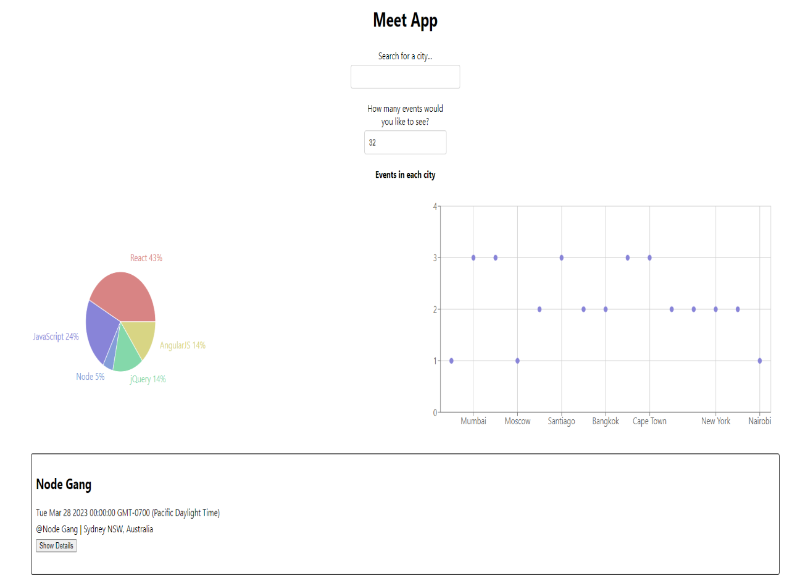

# Meet App

- This PWA is deployed at https://loganjlevin.github.io/meet/

## Description:

This is a progressive web app that lets the user search for tech events in your city. The application shos how many events are happening in a particular city and timeframe, the details of the events, and finally what types of events are most common in the area. The Meet App is currently connected to a Google Calendar with mock data for demonstration purposes. This app will use serverless functions (AWS Lambda) for the authorization server in order to access the Google Calendar API through OAuth2 in order to fetch data about upcoming events.

## Features

- Filter events by city
- Show/hide event details
- Specify number of events shown on the page
- Use the app when offline
- Add an app shortcut to the home screen
- View a chart showing the number of upcaming events by city

## Technologies

- React
- Recharts
- Axios
- AWS Lambda
- Google OAuth2
- Google Calendar API
- Jest
- Cucumber
- Enzyme
- Puppeteer
- Atatus

## Screenshot

## User Stories

### FEATURE 1: FILTER EVENTS BY CITY

User story: As a user I should be able to filter events by city so that I can see the list of
events that take place in that city.

Scenario 1: When the user hasn’t searched for a city, show upcoming events from all
cities.

- Given: the user hasn’t searched for any city

- When: the user opens the app

- Then: the user should see a list of all upcoming events

Scenario 2: User should see a list of suggestions when they search for a city.

- Given: the main page is open

- When: the user starts typing in the city textbox

- Then: the user should see a list of cities (suggestions) that match what they’ve
  typed

Scenario 3: User can select a city from the suggested list.

- Given: the user was typing “Berlin” in the city textbox and the list of suggested
  cities is showing

- When: the user selects a city (e.g., “Berlin, Germany”) from the list

- Then: their city should be changed to that city (i.e., “Berlin, Germany”) and the
  user should receive a list of upcoming events in that city

### FEATURE 2: SHOW/HIDE AN EVENT'S DETAILS

User story: As a user I should be able to show and hide an event’s details so I can see
more or less information about that event.

Scenario 1: An event element is collapsed by default

- Given: the user hasn’t clicked the ‘show details’ button

- When: the user opens the app

- Then: the user should not see the event’s details

Scenario 2: User can expand an event to see its details

- Given: the main page is open

- When: the user clicks the ‘show details’ button

- Then: the user should see the event’s details

Scenario 3: User can collapse an event to hide its details

- Given: the user has previously clicked the ‘show details’ button

- When: the user is on the main page

- Then: the user should not see the event’s details

### FEATURE 3: SPECIFY THE NUMBER OF EVENTS

User story: As a user I should be able to specify the number of events shown so that I
can see however many events I want at one time.

Scenario 1: When user hasn’t specified a number, 32 is the default number

- Given: the user hasn’t specified an event

- When: the user opens the app

- Then: the user should see a list of 32 events

Scenario 2: User can change the number of events they want to see

- Given: the main page is open

- When: the user enters the number of events they want to see in the “number of
  events listed’ input box

- Then: the user should see the specified number of events in the list

### FEATURE 4: USE THE APP WHEN OFFLINE

Scenario 1: Show cached data when there’s no internet connection

- Given: the user has visited the site before

- When: the user opens the app

- Then: the user should see the cached data about the events they have
  previously seen

Scenario 2: Show error when user changes the settings (city, time range)

- Given: There is no internet connection

- When: the user searches for data that has not been cached

- Then: the user should see an error showing that there is not internet connection

### FEATURE 5: DATA VISUALIZATION

Scenario 1: Show a chart with the number of upcoming events in each city

- Given: the user is on the main page

- When: the user clicks the ‘visualize data’ button

- Then: the user should see a chart with the number of upcoming events in that
  city by category
